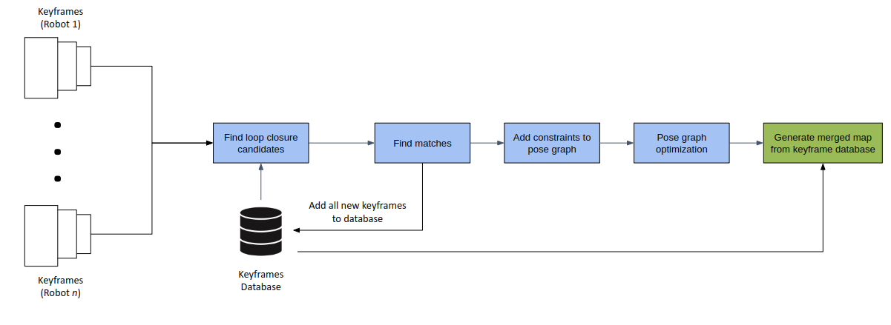

# elastic_map_merge_3d

***elastic_map_merge_3d***  is a ROS package for merging multiple 3D point cloud maps through keyframe loop detection process. This package aims to improve upon existing rigid map-merging processes, which typically take the entire 3D point cloud map from each robot in the multi session and attempt to merge them together by applying a rigid transform. However, such rigid map-merging processes usually suffer from distortions as certain parts of the map fail to align properly. Hence, ***elastic_map_merge_3d*** aims to address this issue by merging maps through a less rigid keyframe loop detection based method.

## Installing
As ***elastic_map_merge_3d*** merges 3D point clouds through a keyframe loop detection process, a 3D SLAM algorithm that can output keyframe messages is required. A modified version of ***hdl_graph_slam*** has been created to output keyframe messages for the map-merger process. Download and install the modified ***hdl_graph_slam*** package according to the repository instructions here:
- [hdl_graph_slam](https://github.com/leonardlohky/hdl_graph_slam)

Note that if you want to perform map-merging in real-time on actual robots, then ***hdl_graph_slam*** needs to be installed on each individual robot involved.

The following ROS packages are required for ***elastic_map_merge_3d*** package:
- [fast_gicp](https://github.com/SMRT-AIST/fast_gicp)

The package is released for ROS Melodic. Build it through `catkin_make` process. `git clone` it to your `catkin_ws/src` folder. After that, build the package through `catkin_make`
```
cd ~/catkin_ws/src
git clone https://github.com/leonardlohky/elastic_map_merge_3d
cd ..
catkin_make
```
## Process

The map merger process used for this package is illustrated below:


## Execution

### Step 1: Set important parameters in the elastic_map_merge_3d launch file
A template launch file can be found under `launch/elastic_map_merge.launch`, modify it accordingly to suit the application. Some important parameters that need to be set to ensure that the ***elastic_map_merge_3d*** package can automatically find multiple robots and their respective keyframe topics includes the following: <br>

|  Parameter Name |       Meaning     |    Values    |
|:---------------:|:-----------------:|:------------:|
| robot_kf_topic | Name of robot keyframe topic without namespaces | string, default: `keyframes` | 
| robot_namespace | Fixed part of the robot keyframe topic. Only topics which contain (anywhere) this string are considered for lookup | string, default: `<empty string>` |

### Step 2: Create respective hdl_graph_slam roslaunch file for each robot
Create a respective hdl_graph_slam roslaunch file for each robot that will be involved in the multi-session. Examples can be found in the `hdl_graph_slam/launch` folder, use that as reference to create a suitable launch file for your own robot. Take note of the `robot_ns` param within the launch file, they should all have a common prefix, e.g. `multirobot_0X` so that the ***elastic_map_merge_3d*** package can automatically find them as detailed in ***Step 1***.

### Step 3: Running hdl_graph_slam multi session
Start the ***hdl_graph_slam*** package on each robot through their respective roslaunch files:
```bash
# Example

## Robot 1
roslaunch hdl_graph_slam robot_1.launch

## Robot 2
roslaunch hdl_graph_slam robot_2.launch

## etc
```

### Step 4: Run the elastic_map_merge_3d package
To execute the process, simply run the launch file. Remember to source for the workspace if you have not.
```bash
roslaunch elastic_map_merge_3d elastic_map_merge.launch
```

## Troubleshooting

### The whole pose graph and map suddenly shifts
This issue is caused by the `g2o_solver_num_iterations` parameter under the g2o solver. It appears the higher the number of iterations, the more likely this issue will occur. To fix this, reduce the number of iterations.

### The maps are not merging
Check that the `use_floor_information` parameter in the launch file is set to false. For some reason, if the map merger uses floor information from the keyframes to add constraints to the pose graph, the maps will not merge even though loop closures are successfully detected. I am not sure as to the reason why map merger will not happen if floor information is used even though it worked for the original `hdl_graph_slam` package. If anyone manages to figure out the reason, do let me know.

## Copyright

The package is licensed under MIT license

## Acknowledgement

This package loop detection method is based on the one created in the original [hdl_graph_slam](https://github.com/koide3/hdl_graph_slam) by koide3.